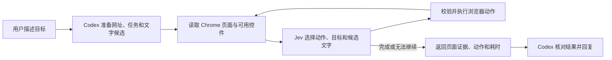

<div align="center">


# jev-browser-skill

### ⚡ 让 Codex 快速操作浏览器的 Jev Skill

**一句话启动，Jev 连续执行。把浏览器操作装进一个轻量 Skill。**

[](LICENSE)
[](#使用前准备)
[](SKILL.md)
[](https://github.com/wanghai673/jev-browser-skill/actions/workflows/checks.yml)

[为什么主打快](#为什么主打快) · [快速开始](#快速开始) · [使用示例](#可以怎么用) · [工作原理](#它怎么工作) · [当前边界](#当前边界)

</div>

看完 [Jev Ultrafast](https://github.com/browser-use/jev-ultrafast) 的浏览器演示，想把 Jev 用进自己的日常工作？这个仓库把它整理成了一个可以安装到 Codex 的 **浏览器 Skill**。安装并配置后，直接在对话里说出目标，就能把一次网页任务交给 Jev 执行。

> 打开 B 站，搜索 machine learning，展示搜索结果。

Codex 准备好起始网址、任务和搜索词，发起一次调用。Jev 根据实际页面选择点击、输入、滚动和切换任务标签页，持续运行到完成、无法继续或达到整次调用上限，最后返回页面证据和执行记录。

## 为什么主打快

浏览器自动化的等待，既来自网页，也来自模型调用和 Agent 交接。**这个 Skill 从执行链路入手，减少每一步的额外往返。**

| 设计 | 减少哪一段等待 |
| --- | --- |
| **一次请求，选择动作与目标** | 操作和目标选择放在同一次 Jev API 请求中；只执行匹配的目标结果。 |
| **预先备字，直接填入** | 搜索词等文本提前准备好，输入阶段不再请求额外的文字生成模型。 |
| **一次委派，持续操作** | Jev 在调用内连续执行，主 Agent 不逐步接管普通点击和滚动。 |
| **结构化页面，直接决策** | 默认读取 DOM 文字与控件，决策循环省去截图生成和图像理解环节。 |

这也是把 [Jev Ultrafast](https://github.com/browser-use/jev-ultrafast) 带进 Skill 工作流的意义：**主 Agent 交代目标，Jev 跑完浏览器循环，再带回证据。** 实际耗时随网站、任务和 API 延迟变化；本仓库尚未提供通用提速倍数。

## 一个 Skill，交付完整执行链

| 特点 | 实际带来的变化 |
| --- | --- |
| **一次调用，连续执行** | 主 Agent 提交完整任务；浏览器循环内由 Jev 持续决策，普通误点由循环自行尝试恢复。 |
| **先备好文字，再让 Jev 选择** | 搜索词等文字通过 `--inputs` 提供。Jev 选择输入框与候选内容，代码原样填入。运行时只调用 Jev，没有额外的文字生成模型。 |
| **连接现有 Chrome** | 使用已有浏览器配置和登录态；默认在后台操作，`--show` 会在结束时展示页面。 |
| **任务结束，证据带回来** | 返回最终页面、任务标签页、观察到的页面与导航、近期动作、耗时，以及被排除的重复动作。 |
| **每次任务重新开始** | 不恢复旧任务或旧会话。跨页面上下文只在本次调用内保留，浏览器页面和登录态继续存在。 |
| **减少原地重复** | 同一操作连续三次没有可观察进展，会在该页面范围内被排除，让 Jev 尝试其他可用选项。 |

本项目基于 Browser Use 的开源运行时进行适配，重点是 **把 Jev 带进 Codex 的 Skill 工作流**。它是独立社区项目，与 Browser Use、TypeSafe、OpenAI 无官方隶属关系。

## 快速开始

### 使用前准备

- **macOS + Google Chrome**：当前启动器使用 macOS 默认 Chrome 配置目录；其他系统尚未适配。
- **Python 3.12+、[uv](https://docs.astral.sh/uv/)、Git**：运行时依赖由 uv 安装。
- **Codex**：用于发现和调用此 Skill；也可以直接使用下面的命令行入口。
- **[TypeSafe API Key](https://docs.typesafe.ai/)**：浏览器循环通过 TypeSafe API 调用 Jev，可能产生 API 费用。
- 在 Chrome 中打开 `chrome://inspect/#remote-debugging`，启用远程调试；若 Chrome 提示允许调试连接，按界面完成授权。

### 1. 安装 Skill

```bash
git clone https://github.com/wanghai673/jev-browser-skill.git \
  "${CODEX_HOME:-$HOME/.codex}/skills/jev-browser"
```

如果目标目录已有 `jev-browser`，先保留已有版本，再选择一个空目录进行安装，避免覆盖你的本地修改。重新打开 Codex 会话以加载技能。

### 2. 配置 Jev

在 `~/.config/jev-browser/.env` 中添加以下配置（已有文件请编辑，不要覆盖）：

```dotenv
TYPESAFE_API_KEY=your_typesafe_api_key
TYPESAFE_MODEL=jev-latest
```

目录不存在时先执行 `mkdir -p ~/.config/jev-browser`。配置值直接填写，不加引号；不要把真实密钥写进任务、截图或 Git 提交。也可以通过环境变量提供以上配置。

### 3. 开始使用

在 Codex 中输入：

```text
使用 $jev-browser，打开 B 站，搜索 machine learning，展示搜索结果。
```

或者直接运行：

```bash
python3 "${CODEX_HOME:-$HOME/.codex}/skills/jev-browser/scripts/jev.py" run \
  --url 'https://www.bilibili.com' \
  --goal 'Search Bilibili for machine learning and show the search results.' \
  --inputs '[{"value":"machine learning","purpose":"Bilibili search query"}]' \
  --show
```

首次执行时，uv 会创建运行环境并安装依赖。需要先检查连接时，可执行 `python3 <skill-dir>/scripts/jev.py tabs`；它只列出标签页，不调用 Jev。

## 可以怎么用

下面是任务写法示例，**不是这些网站的成功率保证**。清楚描述起点、目标与结束条件，通常比只说“帮我看看”更容易检查结果。

| 想做的事 | 可以对 Codex 这样说 |
| --- | --- |
| 搜索内容 | 使用 `$jev-browser`，打开 B 站，搜索 machine learning，停在搜索结果页。 |
| 查找资料 | 使用 `$jev-browser`，从维基百科首页搜索 Monte Carlo method，打开条目并返回标题和链接。 |
| 浏览开源项目 | 使用 `$jev-browser`，打开 GitHub，搜索 browser-use，打开对应项目。 |
| 筛选列表 | 使用 `$jev-browser`，在当前指定页面选择目标筛选项，返回页面显示的条件和前几条结果。 |

需要填字时，Codex 会先准备候选项：

```json
[
  {"value": "machine learning", "purpose": "视频搜索关键词"}
]
```

**候选项是可选内容，不是硬编码的操作顺序。** Jev 决定是否填写、填到哪个框、选择哪项。缺少所需文字时会返回输入错误，不会调用另一个模型临时编造。

## 它怎么工作



- **读取**：从页面 DOM 提取文字和控件，给本次观察到的元素编号。默认决策循环不依赖截图。
- **选择**：把操作和对应目标作为动态选项，在一次 Jev API 请求中提出多个选择问题，只执行被选中操作对应的目标。
- **执行**：重新检查页面与目标状态；填字使用已提供的原文。Jev 的输出不会被当成 JavaScript 或任意选择器执行。
- **检查**：携带本次任务的页面和导航证据继续循环。`DONE` 是模型的停止选择，最终是否完成仍需结合证据判断。

这里的“运行时只调用 Jev”指浏览器执行循环。外围理解任务和总结结果的 Codex 仍然使用它自己的模型。

<details>
<summary>命令行参数与返回结果</summary>

| 参数 | 含义 |
| --- | --- |
| `run` | 启动一个全新任务。 |
| `tabs` | 列出浏览器标签页，供明确指定已有标签页时使用。 |
| `--url` | 已知起始网址，与 `--target-id` 二选一。 |
| `--target-id` | 用户指定的已有标签页 ID。 |
| `--goal` | 完整任务及所需结果证据。 |
| `--inputs` | 包含 `value`、`purpose` 的 JSON 数组。无填字需求时可省略。 |
| `--show` | 结束时展示任务页面。 |
| `--max-actions` | 整次调用动作上限，默认 `200`。 |
| `--max-seconds` | 整次调用时间上限，默认 `300` 秒。 |

正常完成返回 JSON，包含 `status`、`stop_choice`、`page`、`tabs`、`evidence`、`actions`、`action_count`、`excluded_actions`、`timing` 等字段；失败返回 `status: "error"` 和原因，退出码为 `1`。早期初始化失败可能只有错误原因，没有页面证据。

</details>

## 当前边界

这是一个可试用的早期项目，适合从清晰、低风险的网页任务开始。

- **平台**：当前启动器仅适配 macOS 默认 Chrome 配置目录，且同一时刻只允许一个 Jev 任务运行。
- **页面支持**：复杂自定义控件、嵌套滚动等页面结构可能无法正确识别。已观察到 LeetCode 的“困难 + 最新排序”任务因筛选控件未识别而失败；打开某道题不能算完成筛选。
- **人工步骤**：登录、验证码、所需输入缺失或无法使用的控件可能使任务停止，需要用户处理后重新发起任务；不会恢复旧任务状态。
- **性能**：本仓库没有发布通用速度或成功率基准。上游演示的耗时不代表这个 Skill 的实际表现，API 延迟和页面复杂度都会影响速度。
- **数据范围**：可见页面文字、控件、任务描述和候选输入会发送给 TypeSafe API。使用前确认任务内容适合交给该服务处理；浏览器连接保留现有登录态。

首图由 AI 生成，是概念配图，不是实际运行截图。

## 开发与验证

```bash
cd scripts/runtime
uv sync --locked
uv run pytest -q
uv run ruff check .
node --check jev_ultrafast/snapshot.js
node --check jev_ultrafast/background.js
```

仓库包含重复操作排除与执行循环的离线回归测试；测试通过不等于任意真实网站上的任务通过。提交问题时，欢迎提供可公开的目标、页面、失败步骤和脱敏后的结果证据。

## 致谢

- [browser-use/jev-ultrafast](https://github.com/browser-use/jev-ultrafast)：上游浏览器 Agent 运行时，本项目在其基础上增加并整理了 Skill 集成、预置输入、单次调用执行及结果证据等能力。
- [TypeSafe / Jev](https://docs.typesafe.ai/)：浏览器动作选择 API。
- [Browser Harness](https://github.com/browser-use/browser-harness)：浏览器连接与执行基础设施。

代码采用 [MIT License](LICENSE)，保留上游版权声明。来源与适配说明见 [NOTICE](NOTICE)。

如果你也想把 Jev 接进自己的 Agent 工作流，欢迎 Star、提 Issue，或贡献一个可复现的网页任务。
